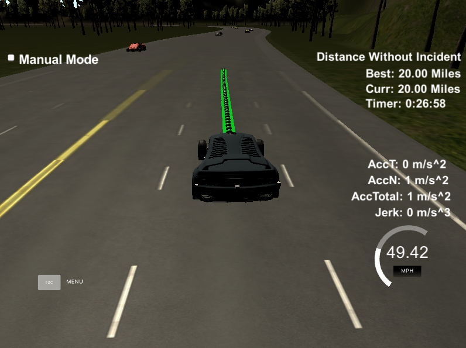

# CarND-Path-Planning-Project
Self-Driving Car Engineer Nanodegree Program

## Goals
In this project the goal is to safely navigate around a virtual highway with other traffic that is driving +-10 MPH of the 50 MPH speed limit. I'll use the car's localization, sensor fusion and map data to build a path planner. The car should try to go as close as possible to the 50 MPH speed limit, which means passing slower traffic when possible, note that other cars will try to change lanes too. The car should avoid hitting other cars at all cost as well as driving inside of the marked road lanes at all times, unless going from one lane to another. The car should be able to make one complete loop around the 6946m highway. Since the car is trying to go 50 MPH, it should take a little over 5 minutes to complete 1 loop. Also the car should not experience total acceleration over 10 m/s^2 and jerk that is greater than 10 m/s^3.


## [Rubric points](https://review.udacity.com/#!/rubrics/1971/view)

### Compilation
#### The code compiles correctly.
My code compile without errors with `cmake` and `make`.


### Valid Trajectories
#### The car is able to drive at least 4.32 miles without incident
The car is able to drive 20 miles without incident.


Here is the [result vedio](https://www.youtube.com/watch?v=lQIFHnf9xug)

####  The car drives according to the speed limit.
The car doesn't drive faster than the speed limit(50 mph). And it only drives much slower than speed limit when obstructed by traffic.

#### Max Acceleration and Jerk are not Exceeded.
The car does not exceed a total acceleration of 10 m/s^2 and a jerk of 10 m/s^3.

#### Car does not have collisions.
The car is able to avoid collisions on the road.

#### The car stays in its lane, except for the time between changing lanes.
The car is able to stay in its lane, except for changing lanes.

#### The car is able to change lanes
The car is able to smoothly change lanes when a slower moving car is in front of it and an adjacent lane is clear of other traffic.


## Reflection
The code for path planning algorithm is in [src/main.cpp](https://github.com/hankkkwu/SDCND-P7-Path_Planning/blob/master/src/main.cpp) starts from line 107 to line 375, comments are provided to improve the code readability.
Basiclly, the code consist of three parts:

### Prediction
In this part of code (line 107 ~ line 219), I use the data(velocity, s and d in frenet) from sensor fusion to predict where other cars would be in around 1 second, and use these information to solve the following situations:
1. Is there a slow moving car in front of us within 30 meters?

   First, I'll check if the car is in the same lane line with our car, then calculate the distance between us after 1 second, if the distance is less than 30 meters, I will raise a flag as too close, and keep track that car's s value and speed.


2. Is it safe to change lanes?

   If other cars are not in the same lane with our car, I'll check which lane the car is, and use our car's s value as origin, set a range between -10m to 30m, if any other lane has any car within this range, that lane would not be safe to change lane to. I also check the distance between the car in other lane and the car in front of us, if the distance less than 10 meters, that lane will be consider as not safe to change lane to.


### Behavior Planning
Based on the prediction of other cars, we need to decide what kind of behavior our car should planning to do (code from line 217 to line 267):
1. When there is a slow moving car in front of us within 30 meters, do we need to slow down, change lane to right or change lane to left?

   If there is a slow moving car in front of us within 30 meters, I'll first check if the left lane is safe to change or not, if it's safe to change, then I will check if there is any car in left lane and right lane 80 meters ahead, though the left lane is safe to change, we still might be obstructed by traffic. If left lane is safe to change and there is no car in left lane 80 meters ahead, I'll change to left lane. If there is a car in left lane 80 meters ahead, and there is no car in right lane 80 meters ahead, I'll change to right lane. And the same logic for checking the right lane is safe to change or not. Finally, if lane change is not available, I'll slow down to the front car's speed.


2. When to speed up?

   When there is no car in front of us within 30 meters and our speed is slower than the speed limit (50mph), I'll speed up the car.


### Generate Trajectory
This part of code (line 269 ~ line 373) uses our car's speed and lane output from behavior planning, also some information about car's x, y, yaw, and previous path points to calculate the trajectory.

To generate trajectories, I'll use spline instead of quintic polynomial. before using spline, I need to create a list of widely spaced waypoints (I will create 5 waypoints in this project), the first two waypoints will be the last two points of the previous trajectory (or the car position if the previous trajectory has less than 2 points left), and the last three waypoints would be evenly spaced at 30m ahead of the starting point(the second waypoint), then to make it easier to compute,I will use starting point as origin(0,0), shift all the waypoints, and rotate car reference angle to 0 degree, finally feed those 5 waypoints into spline to create points to fit in my path planner. My path planner will have 50 points, if I have any point from previous path, I'll just add them into the path planner, and then add the points spline created, so the path planner will always have 50 points.


## Running the Code
### Simulator
You can download the Term3 Simulator which contains the Path Planning Project from the [releases tab] (https://github.com/udacity/self-driving-car-sim/releases/tag/T3_v1.2).  

To run the simulator on Mac/Linux, first make the binary file executable with the following command:
```shell
sudo chmod u+x {simulator_file_name}
```

### Basic Build Instructions
1. Clone this repo.
2. Make a build directory: `mkdir build && cd build`
3. Compile: `cmake .. && make`
4. Run it: `./path_planning`.


### Dependencies

* cmake >= 3.5
  * All OSes: [click here for installation instructions](https://cmake.org/install/)
* make >= 4.1
  * Linux: make is installed by default on most Linux distros
  * Mac: [install Xcode command line tools to get make](https://developer.apple.com/xcode/features/)
  * Windows: [Click here for installation instructions](http://gnuwin32.sourceforge.net/packages/make.htm)
* gcc/g++ >= 5.4
  * Linux: gcc / g++ is installed by default on most Linux distros
  * Mac: same deal as make - [install Xcode command line tools]((https://developer.apple.com/xcode/features/)
  * Windows: recommend using [MinGW](http://www.mingw.org/)
* [uWebSockets](https://github.com/uWebSockets/uWebSockets)
  * Run either `install-mac.sh` or `install-ubuntu.sh`.
  * If you install from source, checkout to commit `e94b6e1`, i.e.
    ```
    git clone https://github.com/uWebSockets/uWebSockets
    cd uWebSockets
    git checkout e94b6e1
    ```


## Details

1. The car uses a perfect controller and will visit every (x,y) point it recieves in the list every .02 seconds. The units for the (x,y) points are in meters and the spacing of the points determines the speed of the car. The vector going from a point to the next point in the list dictates the angle of the car. Acceleration both in the tangential and normal directions is measured along with the jerk, the rate of change of total Acceleration. The (x,y) point paths that the planner recieves should not have a total acceleration that goes over 10 m/s^2, also the jerk should not go over 50 m/s^3. (NOTE: As this is BETA, these requirements might change. Also currently jerk is over a .02 second interval, it would probably be better to average total acceleration over 1 second and measure jerk from that.

2. There will be some latency between the simulator running and the path planner returning a path, with optimized code usually its not very long maybe just 1-3 time steps. During this delay the simulator will continue using points that it was last given, because of this its a good idea to store the last points you have used so you can have a smooth transition. previous_path_x, and previous_path_y can be helpful for this transition since they show the last points given to the simulator controller with the processed points already removed. You would either return a path that extends this previous path or make sure to create a new path that has a smooth transition with this last path.
